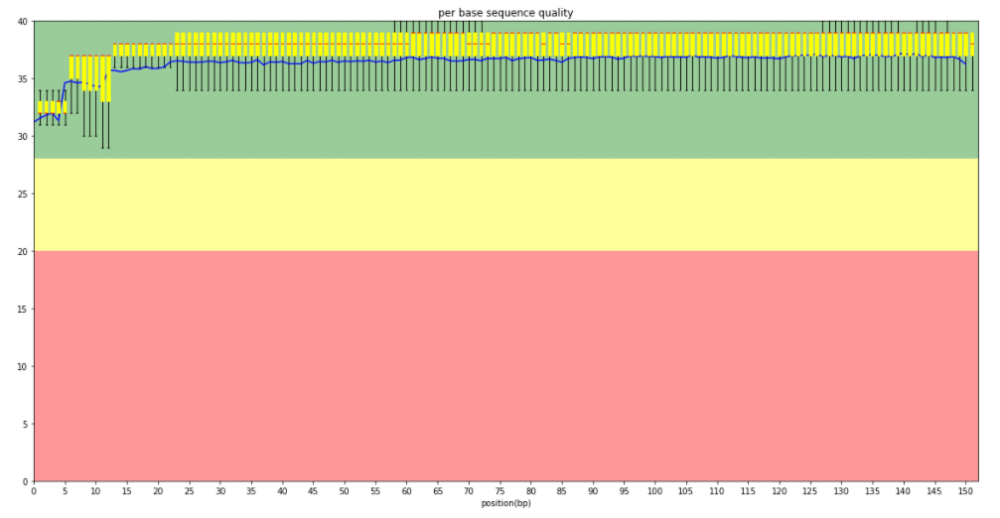

## A1 Life Sciences interview


### Q1 DNA animation with threeJS

- Read DNA sequence from text
- Create dna sequence pairs
- virtulaize with threeJS

- Adenine --> purple ball
- Thymine --> red ball
- Guanine --> green ball
- cytosine --> orange ball


### Q2 Phred Score


```python
def calc_q(p):
    return int(-10*math.log10(p))
```

biopython [Link] https://biopython.org/

```python
l=[] 
for fasta in fasta_sequences:
        name, sequence,ann = fasta.id, str(fasta.seq), fasta.annotations
        print(fasta.letter_annotations["phred_quality"])
        l.append(fasta.letter_annotations["phred_quality"])
        print("========")
```


### Q3 Machine Learning Predict

#### Training
- Read data from csv
- Data Process, create new feature
  Age_group, R2: from Stability of Body Weight in Type 2 Diabetes [Link] https://www.researchgate.net/figure/Weight-changes-with-different-treatment-modalities-Data-are-presented-as-means-SE_fig3_7273156
  R2=-0.04*Age+2.5 
- Data Standardization 
- train

#### Predict
- Web app, send data to Flask Api
- Data Process, create new feature
- Load scaler and model
- Data Standardization 
- predict
- return result
- Web app, show response


### Q4 My solutions, i am proud of

- Creating a Graph Model for Retinal Blood Vessels and using it in applications
which requires Graph Similarity Measures [Link] https://github.com/cantek41/RetinaRecognition
- Detection Iris Anomaly System [Link] https://cantek41.github.io/detecting-iris-anomaly/
- Design and Development of Long Nodule Detection and Segmantiton
Interface from CT Images, Unet, MaskRCNN
- Development part of Decision Support System with ML (NATO Shape
Resilience Experiment) – Regression problem
- Solution for Stanford Mura Bone X-Ray Problem with DL, CNN
- CRM backend, .Net Rest-full api sevices, ORM database
