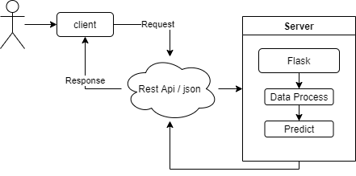

## A1 Life Science interview

### Q1 DNA animation with threeJS

### Q2 Phred Score

'''python
def calc_q(p):
    return int(-10*math.log10(p))
'''

biopython [Link] https://biopython.org/

'''python
l=[] 
for fasta in fasta_sequences:
        name, sequence,ann = fasta.id, str(fasta.seq), fasta.annotations
        print(fasta.letter_annotations["phred_quality"])
        l.append(fasta.letter_annotations["phred_quality"])
        print("========")
'''

### Q3 Machine Learning Predict

### Q4 My solutions, i am proud of

- Creating a Graph Model for Retinal Blood Vessels and using it in applications
which requires Graph Similarity Measures [Link] https://github.com/cantek41/RetinaRecognition
- Detection Iris Anomaly System [Link] https://cantek41.github.io/detecting-iris-anomaly/
- Design and Development of Long Nodule Detection and Segmantiton
Interface from CT Images, Unet, MaskRCNN
- Development part of Decision Support System with ML (NATO Shape
Resilience Experiment) – Regression problem
- Solution for Stanford Mura Bone X-Ray Problem with DL, CNN
- CRM backend, .Net Rest-full api sevices, ORM database
